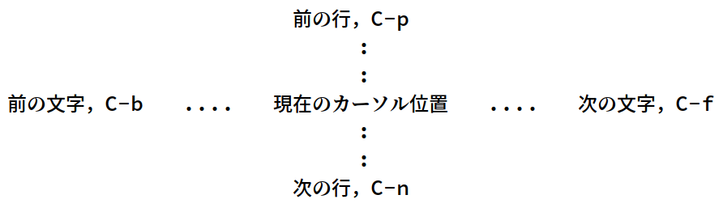

# 04 - Go! Go! Go!

    ＊ここまでの要約
    ================
    
       ファイルを画面毎に見て行くには、次のコマンドを使います。
    
       C-v     次の画面に進む
       M-v     前の画面に戻る
       C-l     画面を書き直す。このとき、カーソルのある行が画面の中央に
         くるようにする。（C-1 じゃなくって C-L ですよ！）
    
    >> カーソルを見つけ、その近くにどんな文章が書かれているかを覚え、
       それから C-l をタイプして下さい。
       カーソルがどこに移動したか、その近くの文章はどうなったかを調べ
       てみましょう。
       もう一度 C-l をタイプして下さい。今見ていた文章は画面の上端に移
       動します。
       そして、もう一度 C-l をタイプして下さい。今度はその文章が画面の
       下端に移動します。
    
    もしあなたのキーボードに PageUp や PageDn キーがあるなら、それらも画面
    を移動するのに使えます。でも、C-v や M-v を使う方が効率的です。

「">>" の記号があるときは『やってみよう』の合図ね」「うむ」「ふつうは C-l を押すと『画面中央→上→下』にうつるんだけど，gnupack だと確か上下にうつるように設定されてます」  

> C-1 じゃなくって C-L ですよ！  

「ふむ。ところでなぜいきなり前回の要約なんだ？そういうのは前回の最後にやるべきだと思うんだが」  

「ふっ」私は勝ち誇った顔をした。「君はコンピュータだからわからないと思うけど，人間は忘れやすいんだよ」「ほう」「新しいこと勉強する前に復習しないと忘れちゃうの。復習大事。わかる？」「わかったことにしておこう」「断じて前の分量が多いから持ち越したわけじゃないからね」「妙に言い訳がましく聞こえるが。まあいいだろう」  

「そうそう，要約って summary の訳なんだけどさ」「うむ」「中国語版見てたら，要約のこと小結 (小结) っていうんだって。面白いね」「…それ今必要なことか？」「面白いね」「おい，それは今必要な」「今納得してくれないとこれから事あるごとに summary は小結なんだって言うよ」「…」「それでもいい？」「…き，興味深いことだな。実に」「でしょ？」「…」  

   

    ＊カーソル移動の基本
    ========================
    
    画面毎の移動はできるようになりました。今度は、画面の中で、特定の場所に
    移動するための方法を憶えましょう。

「ようやく移動か」EeePC が溜め息をつくように言う。「コントローラの準備はいい？」気合を入れる私。「コントローラ？」「オープニングムービー終わってこれから冒険がはじまるところだよ!」「…お，おう…」  

   

        これにはいくつかのやり方があります。矢印キーを使うこともできますが、手
        をキーボード上の標準位置から大きく動かさずに、C-p、C-b、C-f、C-n を使
        う方が効率的です。これらは４つの矢印キーと同じ働きをします。図で書けば、
        次のようになります。

   

  

「意気揚々とのりこんだ結果がこれです」「おう」  

「これ初めて見たときに『うわぁ…めんどくせぇ…』って思わない人がいたらすごいと思う」「そうか」「私がいま見ても思うもん」「そんな慣れないものか？」「身体の動かし方を文章で説明されてる感じ。ふだん意識してないぶん忘れると全然できなくなる」「たとえば？」「声の出し方とか。ひどいめにあったショックで忘れちゃうの」  

「心配するな」「？」「それを助けるために私たちコンピュータがいる」「うん」「困ったときにはいつでも呼んでくれ。できるかぎり君を助けよう」「…ありがと」  

注: Emacs には[30 年以上のキャリア](http://git.savannah.gnu.org/cgit/emacs.git/tree/lisp/play/doctor.el) (?) をもつ[ドクター](https://ja.wikipedia.org/wiki/ELIZA)が常勤しています。 `M-x doctor` でいつでも呼び出せますが，ドクターは英語しか話せません。ご注意ください。  

   

    >> C-n と C-p でカーソルを上図の真中の行に動かして下さい。それから C-l
       をタイプして図の全体が画面中央にくるようにしてみましょう。
    
    これらのコマンドはそれぞれ、Previous, Next, Backward, Forward の頭文字
    になっているので、憶えやすいでしょう。これらは、カーソル移動の基本コマ
    ンドであり、頻繁に使うものです。
    
    >> C-n を何回かタイプし、この行までカーソルを移動させましょう。

「C-n C-p は私もすごく使う」「ふむ」「横書きの文章は画面が上下に進むから，最初は C-n と C-p に慣れておくといいと思う」「なるほどな」「でも私は矢印キーも使う。[スタパ齋藤もカーソルキー使いまくる](https://k-tai.watch.impress.co.jp/docs/column/stapa/730357.html)」「おい，さっきリターンキー使わないのがかっこいいって言ったばかりだろう」「ポリシーがあればいいの。 **矢印キーがついているから『あえて』 HHKB Pro じゃなくて Lite2 を買う** とか， [**英字配列だとキーの数が足りないから JIS 配列のキーボードを英字配列にして使う**](https://www.careertrek.com/daily/shukan-matz/) とか」「…」  

   

    >> C-f を使って行の中ほどに移動し、C-p で何行か上に移動させましょう。
       カーソルの位置の変化に注意して下さい。
    
    各行の最後には（目には見えない）Newline 文字があります。これは次の行
    との区切りを示すためです。普通はファイルの最後の行にも Newline を付け
    るべきです（もっとも Emacs はそれを強制はしませんが）。

「Newline 文字はテキスト処理したことある人なら "\n" とか "\r\n" で知ってると思う」「ふむ」「Word を使ってる人には『行末にある曲がった矢印のようなもの』というと伝わることがある」「そうか」「君も昔は Word のお世話になっていたんだよ」「ずいぶん遠くなってしまったな」「うん」  

「そうそう，Git はファイルの末尾に改行入れないと警告が出るんだよ」「ふむ」「ここでも『付けるべきです』って書かれてるから，なんでそうなのか調べた」「なぜだ？」「[POSIX のルール](https://stackoverflow.com/questions/729692/why-should-text-files-end-with-a-newline)で決まってるらしい」「POSIX」「UNIX の仕様を決めてるところ」「UNIX」「Windows 以外」「その定義は正確か？」「だって iOS は UNIX ベースだし，Android は Linux ベースだし，Linux は POSIX 準拠だし」「TRON があるだろう。FreeDOS や Haiku もある」「超漢字で[トンパ文字](https://ja.wikipedia.org/wiki/%E3%83%88%E3%83%B3%E3%83%91%E6%96%87%E5%AD%97)触ってみたい」「うむ」  

> [3.206 Line  
>       A sequence of zero or more non- &lt;newline&gt; characters plus a terminating &lt;newline&gt; character.](http://pubs.opengroup.org/onlinepubs/9699919799/basedefs/V1_chap03.html#tag_03_206)  

   

    >> 行の先頭で C-b をタイプしてみましょう。カーソルは前の行の末尾に移動
       するはずです。これは C-b が前の Newline 文字を越えて戻ったからです。
    
    同様に C-f はカーソルを Newline 文字を越えて次に進めることができます。
    
    >> さらにもう少し C-b をタイプしてカーソル移動の感じを把んで下さい。
       今度は C-f で行末まで進んで下さい。
       さらにもう一度 C-f をタイプして次の行に進んで下さい。

「なんか世間話ばっかしてるから全然進まないね」「今どれくらいなんだ？」「まだ一割くらい」「おい」「気楽にいこうって行ったのは君でしょ？」「それはそうだが」「私が飽きたらただのコピペになるよ。それでもいいの？」「それは退屈だろうな」「でしょ？じゃあもっと応援してよ」「善処する」  

   
   

(c) 2018 jamcha (jamcha.aa@gmail.com). (c) 1985, 1996, 1998, 2001-2018 Free Software Foundation, Inc.  

  

