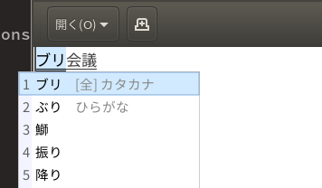

# 08 - ドレミファ挿入

私がチュートリアルを進めようとしていると，EeePCが怒鳴った。「このタイトルは何だ。ふざけてるのか」私は胸をはって答える。「もちろんです!」  

「…はぁ」EeePCはため息をついた。「心配して損したぞ」「君が損しても誰も困らないでしょ」「…清々しいまでの鬼だな，君は」「それにこんな地味なことしてるんだからさ。タイトルだけでも楽しくしたいと思わない？」「まあ，それはそうかもしれんな」  

   

    ＊挿入と削除
    ============
    
    文章を入力したければ、単にそれをタイプして下さい。Emacs は、目に見える
    文字（A, 7, * 等）を文章であるとみなすので、それらはそのまま挿入されま
    す。<Return>（改行キー）をタイプすれば改行文字が挿入されます。

**文章を入力したければ、単にそれをタイプして下さい。**  

「奇妙な言い回しだな」「そう？」「『単に』って，まるで他の作業しないと文字入力できないような言い方じゃないか」「それ，私たちいつもやってるよ」「？」  

「ほら」  

   
  
(<https://mzp.hatenablog.com/entry/2018/02/04/171050> をもとに作成)  

「私たちは変換作業を入れないと平仮名ひとつ入力できない」「平仮名もか」「Enter押すでしょ」「確かに」  

「一応言っておくと，チュートリアルの『単に』っていうのは，1つのキーがコマンドになってるエディタがあるから，それへの配慮だと思う。[ed](http://www.gnu.org/software/ed/manual/ed_manual.html)とか[vim](https://www.vim.org/)とか」「君はedとvimは使わないのか」「edは使ったことないけどvimは使います。[qutebrowser](https://qutebrowser.org/)だってvimのキーバインドだし」  

   

    直前に入力した文字を削除するには、<Delback> をタイプします。<Delback>
    は、Emacs 以外で、最後にタイプした文字を削除するために使うキーボード上
    のキーです。通常は、 <Return> キーの上方にある大きめのキーで、
    "Delete" とか "Del" とか "Backspace" と書いあります。
    
    もし、そのそれが "Backspace" と書いてあるなら、それが <Delback> キーです。
    その場合、他の場所に "Delete" と書いてあるキーがあるかもしれませんが、
    それは <Delback> キーではありません。
    
    より一般的に言うなら、<Delback> は現在カーソルのある位置の直前の文字を
    削除します。

「Delbackって表現は英語版と中国語版にはないから，チュートリアル独自の表現か，昔はあったのかも。ワープロ専用機だと『後退』っていう難しい字のキーだった」「読めてるだろう」「昔は読めなかったんだよ。ローマ字書けないからかな打ちだったし」「昔から機械が好きだったんだな」「うん。あ，最後にも書かれてるけどDelbackはBackspaceのことです。カーソルの前の字を消すキー。あと4行目の文末は原文ママです」「君のキーボードにはBackspaceがないな」「スマホと同じ記号になってるね。これから記号に置き換わっていくのかな？」  

   

    >> 文字をいくつかタイプし、それからそれらを <Delback> を使って削除し
       て下さい。このファイルを変更することを気にする必要はありません。オ
       リジナルの入門ガイドファイルは変更されませんから。今見ているファイ
       ルはあなたのためのコピーです。
    
       文章の一行が画面に収まらない程長くなった場合、その行は画面上の次の行へ
       と継続（continued）されます。画面の右端（右側のフリンジエリア）の
       backslash 文字 「\」 （あるいは、もしウィンドウシステムを使っているなら、
       小さな曲った矢印）は、その行が継続されていることを表しています。
    
    >> 画面の右端まで文章を入力し、さらに入力を続けて下さい。
       継続行ができるのが分るでしょう。
    
    >> <Delback> を使って１行に収まるところまで現在の行を短くしてみてくださ
       い。継続行は消えます。
    
       改行文字も他の文字と同じように削除できます。２つの行の間の改行文字を消
       すとそれらの行が合わさり１つの行になります。もしその合わさった行が画面
       の幅よりも長い場合は、継続行となって表示されます。
    
    >> カーソルを行の先頭に移動し、<Delback> をタイプして下さい。現在の行が
       その前の行とつながります。
    
    >> <Return> をタイプして、今削除した改行文字をまた挿入して下さい。

「後で説明されるかもしれないけど，Emacs使ってる人のほとんどはBackspaceを **C-h** に割り当ててると思う。私もそう。矢印キーは使うけどBackspaceキー自体は本当に使わない」「なぜだ」「私の手が小さいから。[鬼軍曹.el](https://github.com/k1LoW/emacs-drill-instructor/wiki)でもC-h使えっていってるし，最初から慣れておくといいと思います」  

   
「英語版と中国語版はリターンキーの説明が追加されてる」  

    The <Return> key is special, in that pressing it may do more than
    just insert a Newline character.  Depending on the surrounding text,
    it may insert whitespace after the Newline character, so that when
    you start typing on the newly created line, the text lines up with
    that on the previous line.  We call this behavior (where pressing a
    key does more than simply inserting the relevant character) "electric".
    
    >> Here is an example of <Return> being electric.
       Type <Return> at the end of this line.
    
    You should see that after inserting the Newline, Emacs inserts spaces
    so that the cursor moves under the "T" of "Type".

> リターンキーは特別なもので，単に改行文字を挿入する以上のものです。周囲の文章に応じて，リターンキーは改行文字のあとに空白を挿入します。これにより，新しく作成された行で入力を始めると，その行は前の行に揃えられます。この動作 (キー入力が文字入力以上の動作をすること) は『シビれる』と呼ばれます。  
> 
> &gt;&gt;&nbsp;&nbsp; &lt;Return&gt; のシビれる例を試してみましょう。  
> &nbsp;&nbsp;&nbsp;&nbsp;この行末で &lt;Return&gt; をタイプしてください。  
> 
> 新たな行が挿入されたあと，Emacsが空白を挿入し，カーソルが『この行末』の『こ』に移動したのがわかるでしょう。  

「"electric" を『シビれる』と訳したか」「[Emacs Wiki](https://www.emacswiki.org/emacs/Electricity)だと『クソ便利』な気が利く機能を "electric" というらしい」「ふむ」「中国語版にその一文はなくて，ドイツ語とヘブライ語にはあった」「ほう」  

   

    Emacs のほとんどのコマンドは、繰り返しの回数指定できることを思い出して
    下さい。これは、文字の挿入についても当てはまります。
    
    >> C-u 8 * とタイプすると ******** が挿入されます。試してみましょう。

「恥ずかしながら今までこの機能を忘れておりました」「キー押しっぱなしにしてたんだな？」「うん」「ひとつ進歩したな」「はい」  

   
   
(c) 2018 jamcha (jamcha.aa@gmail.com). (c) 1985, 1996, 1998, 2001-2018 Free Software Foundation, Inc.  

  

