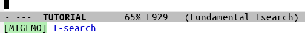

# 18 - 心の声

「(…EeePC… EeePC… 私の声が聞こえますか…)」「…」  

「(チュートリアルに入るまえに，[cmigemoとmigemo](https://github.com/emacs-jp/migemo)をインストールするのです…)」「…」「(インストールせずにチュートリアルに入ってはいけません…)」「…」  

「(cmigemoはUbuntuなら `$sudo apt install cmigemo` ，migemoは `$sudo apt install elpa-migemo` でインストールできます…)」「…」  

「(migemoのcoding systemを聞かれたら… `utf-8` にするのです…)」「…」  

「(入れましたか… …次に… `C-x C-f ~/.emacs.d/init.el` をタイプし…)」  

    (load "migemo")

「(と入力しなさい…そして `C-x C-s` をタイプし… Emacsを再起動するのです…)」「…」「(いいですか… 決して… 決して… migemoを入れずにチュートリアルに入ってはいけません…)」「…」「(決して…)」  

   

    ＊検索
    ======
    
    文章中の特定の文字列を、前向きにも後向きにも探す事ができます。文字列を
    探すというのはカーソル移動コマンドです。つまり、次にその文字列が現れる
    場所までカーソルを移動させるのです。
    
    Emacs の検索コマンドは「インクリメンタル」です。検索する文字列をタイプ
    しているそばから検索が起るのです。

「Emacsは普通のワープロと違って検索ウインドウは出てこない」「ほう」「代わりに画面下のエコーエリアを使う」「ふむ。やってみるか」  

   

    検索を始めるためのコマンドは、前向きに検索するならば C-s、後向きなら
    C-r です。まだです！！今はまだ試さないで下さい。
    
    C-s を打つと "I-search" という文字列がエコーエリアに表示されるのが見え
    るでしょう。これは Emacs がインクリメンタル検索という状態にいて、あな
    たが探したい文字列を入力するのを待っているのです。<Return> を打てば検
    索を終われます。

   
  

   
「ふむ，I-searchが出たな。これでどうするんだ？」  

「待って!」  

「!？」  

「どうしてmigemo入れてないの!?」「み…migemo?」「入れてって言ったじゃん!」「はぁ？いつの話だよ」「ついさっき!」「つ，ついさっきって…まさか，君が私の前で手を組んで，祈るようなポーズしていたときか？」「そうだよ!絶対インストールしてほしいから，心の声でずっとお願いしてたのに!」  

「ちょ，ちょっと待て。いくらなんでもムチャクチャすぎる」「migemoなしじゃ…日本語で…検…索…でき…な…」  

「お，おい!私が悪いのか!？君の操作なしでは何もできない私に，そのミゲなんとかをインストールしろって，しかも心の声でなんて，あんまりじゃないか!」「だって…これくらい…言わないと…誰も…migemo…インストールしてくれないんだもん…面倒だから…って…」「き…君は何も言っていないだろう…」  

「うう…ひどい…」「ひどいのはどっちだ…。くっ…。…わかった。すまない。私が謝る」「謝っても遅いよ」「お…遅…ゴホン。君の忠告を無視したせいで，私はひどいめにあうところだった。いや，すでにあっているが。それはともかく，私が悪かった。君の手で，そのソフトウェア…でいいのか？を，インストールしてくれないか。君がいなければ，私は何もできない」  

「ほんと？」「本当だとも!」「…いいよ。じゃあインストールしてあげる」「ありがとう」  

   
   
「くっそ…何で動かねえんだこのやろう!」バン!  

「…migemoインストールってこんなに大変なのか…？」  

※ 個人差があります  

   
   
「はぁ…はぁ…それじゃあC-sをタイプします」「…傷だらけだが，薬塗らなくて平気か？」「へいき」  

   
  

「はぁー。よかったぁー」「MIGEMOって表示されてるな」「ようやく先に進めるね」「ああ…ようやくな…」  

   

    >> さて C-s とタイプして検索を始めましょう。ゆっくりと１文字ずつ
       "cursor" という単語を入力します。１文字打つ毎にカーソルがどう動くか
       見ましょう。
       さあ、"cursor" が１回見つかりました。
    >> もう一度 C-s と打って次の "cursor" を見つけましょう。
    >> 今度は <Delback> を４回打って、カーソルの動きを見て下さい。
    >> <Return> と打って検索を終了しましょう。
    
    何が起ったか分りますか？インクリメンタル検索では、あなたがそれまでに打っ
    た文字列が現れるところに行こうとします。次の "cursor" に行くにはもう一
    度 C-s と打ちます。もしもうそういう文字列が無かったら、ベルをならして
    検索が現在は失敗していることを知らせます。C-g を打てば検索を終われます。

   
  

「ね，カタカナのカーソルも検索してくれてるのわかる？」「ああ」「これがmigemo。ローマ字のまま検索してくれるの」「便利だな」「これがないと日本語検索がすごく面倒。日本語のチュートリアルなのに，日本語の検索例がないのが何よりの証拠」「そんなに大変なのか？」「日本語で検索するにはEmacs内蔵の日本語入力を起動しなきゃいけないんだけど，これの変換精度がめちゃくちゃで我慢できなくなると思う」「君がそんなに言うとは，よほどなんだな」「うん。だから絶対migemo入れて」  

   

        注意して下さい。システムによっては C-s とタイプすると画面が動かなくな
        り Emacs が表示しようとするものが何も画面に出なくなります。これは、フ
        ローコントロールと呼ばれるＯＳの機能が C-s を捉え、Emacs に渡さないよ
        うにしているのです。これを解除するには C-q をタイプします。

「英語版と中国語版にはない記述。C-sすると画面がロックされる。いま試したら，ターミナルで起動したEmacsは例外に加えられてるのか平気だった」「なるほどな。だから英語版では削除されたのかもしれん」  

   

    インクリメンタル検索の途中で <Delback> を打つと検索文字列中の１番最後
    の文字が消えます。そして、カーソルは、前回の位置に戻ります。たとえば、
    "c" とタイプして最初の "c" を探します。それから "u" を打つと最初の"cu"
    の場所にカーソルが動きます。そこで <Delback> を打つと "u" を検索文字列
    から消して、カースルは最初に "c" が現れた場所に戻ります。
    
    C-s は、現在のカーソル位置以降に出てくる検索文字列を探し始めます。もし、
    文章の前の方を探したかったら、C-r をタイプします。これまでの C-s につ
    いての説明はすべて C-r にも当てはまります。検索の方向が反対なだけです。

「最後に簡単に書かれてるけど， **前方検索がC-s** ， **後方検索がC-r** 。しょっちゅう使うから覚えておきましょう」「おう」  

   
「ところでどうして君は設定していないEmacsでチュートリアルをしているんだ？」「だって最強装備で最初の村に戻っても，レベル1の人の苦しみはわからないじゃん」「ああ…確かに」「初めての人に比べたら多少知識はあるから，キーバインド変えたりはできるけど，じゃあmelpaの登録方法ってどうだ，とか，パスの書き方とかフォント設定とか，資料なしにやれって言われてもできないもん。私，君やEmacsに助けられてるけど，設定なしじゃyatexでTeXのコンパイルもできない。自分が驕らないように，あと，初めての人の気持ちを忘れないようにしていきたい」  

「ああ。そうだな。…いつもこれくらいまともなら良いんだが…」「ん？なんか言った？」「なんでもない。さあ。次に進もうか」「うん!」  

   
   
(c) 2018 jamcha (jamcha.aa@gmail.com). (c) 1985, 1996, 1998, 2001-2018 Free Software Foundation, Inc.  

  

