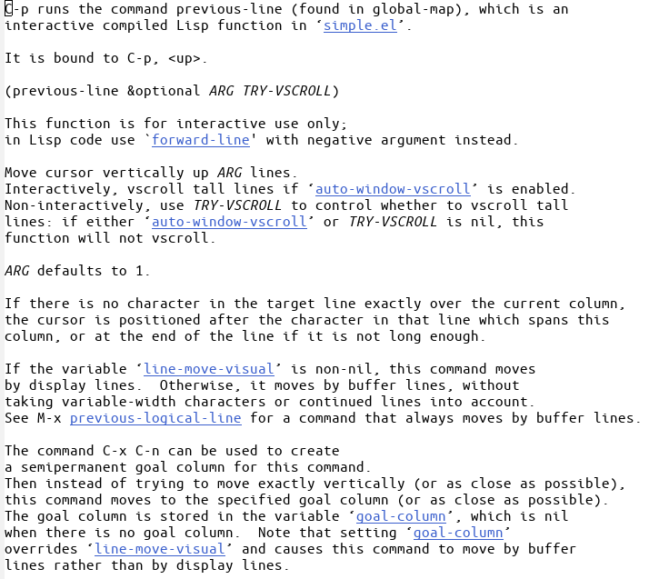

# 21 - 答えは目の前にある

    ヘルプ機能を使うには、C-h に続いてどんな種類のヘルプが必要かを示す１文
    字をタイプします。もしそれすら分らない場合は C-h ? とタイプしましょう。
    どんな種類のヘルプを提供できるかが示されます。もし、C-h をタイプしてか
    ら気が変わったら、C-g をタイプして取り消すことができます。
    
    （もし C-h が画面の下の方にヘルプのメッセージを出さなければ、F1 キーか
    M-x help <Return> を試してみて下さい。）

「C-hは[鬼軍曹.el](https://github.com/k1LoW/emacs-drill-instructor/wiki)だとBackspaceに割り当てられています」「うむ」「この章でC-hはF1に読みかえたほうが今後は便利です」  

   

    最も基本的なヘルプ機能は C-h c です。C-h、それから c、そしてコマンドの
    ** C-h c has been rebound, but you can use <f1> c instead [More] **
    キー若しくはそのシーケンスをタイプすると、そのコマンドについての短い説
    明を表示します。
    
    >> C-h c C-p とタイプしてみましょう。
       以下のようなメッセージが表示されるはずです。
    
          C-p runs the command previous-line
    
    これは「ファンクションの名前」を表示したのです。ファンクション名はその
    コマンドが何をするものなのかが分るように付けられますので、簡単な説明と
    してもそのまま役に立ちます。一度学んだコマンドについて思い出すには十分
    です。

「これ[stackoverflow](https://stackoverflow.com/)でしょっちゅう出てくる」「ほう」「『○○ができない』って質問があると大抵『C-h cで何が出てくるか書け』って」「ふむ」「できない原因がEmacsのコマンド入れ替えてるせいかもしれないから」「Emacsのコマンドは自分で入れ替えるもんじゃないのか」「最初は何すればいいかわからないから誰かが作ってくれた設定を使うんだよ。だから知らないうちに入れ替わって，それが普通になってる」「たとえば？」「[gnupack](https://ja.osdn.net/projects/gnupack/)とか」「ふむ」  

「私がふだん使ってる設定だと，C-hはこんな感じ」  

    C-h runs the command org-delete-backward-char  

「orgはorg-modeのことか？」「そうそう」  

   

    C-x C-s や（メタキーやアルトキーがない場合の） <ESC> v などの複数文字
    のコマンドを C-h c の後にタイプすることもできます。
    
    コマンドについてもっと多くの情報が欲しければ C-h c の代わりに C-h k を
    使います。
    
    >> C-h k C-p とタイプしてみましょう。
    
    Emacsのウィンドウに、コマンドの名前と同時にその機能の説明が表示されま
    す。読み終えたら、C-x 1 とタイプしてヘルプの文章を消しましょう。必ずし
    もすぐにそうする必要はありません。ヘルプの文章を見ながら編集を続け、そ
    れから C-x 1 とタイプしても構いません。

「はい!はい!」「…何だ」「C-h k C-pの中身，全部貼っていい？30行以上あるんだけど」「そんなに長いのか」「ちょっと説明したいことがあるんだ」「そうか。いいぞ」  

   
  

「C-pがどのlispファイルを使ってどう処理してるのかが全部書かれてる。『[Emacsは、セルフドキュメント方式](https://ayatakesi.github.io/emacs/26.1/html/Intro.html#Intro)』っていうのはここから来てる」「ほう」「『これどうやって動いてるんだろう』っていうのを知りたいとき，その答えが読めるとびっくりするほど頭に入る。全部英語だからちょっと難しいけど」「君は私でプログラムを組んだことがないが，どうしてわかるんだ？」「え，あるじゃん。忘れたの？」「え？」「EmacsでSkyrimのスクリプト組んでたじゃん」「いや，あれは…」「魔導書開くとメテオが降ってきたり」「…」「杖使うと馬の群れを召喚したり」「…」「楽しかったね」「…そ，そうか。ああ…いや，君が楽しかったんなら，私は満足だ」「これからもよろしくね」「…ああ」  

   

    C-h には他にも役に立つオプションがあります。
    
       C-h f	ファンクションの説明。ファンクション名を入力します。
    
    >> C-h f previous-line <Return> とタイプしてみましょう。
       C-p コマンドを実行するファンクションについてのすべての情報を表示し
       ます。
    
    これに似たコマンド C-h v は変数の説明を表示します。変数には、その値を
    セットすることによって Emacs の振舞いをカスタマイズできるものもありま
    す。変数名の入力をプロンプトにしたがって入力します。
    
       C-h a	コマンドアプロポス (command apropos)。キーワードを入力
                  すると、そのキーワードを名前に含む全てのコマンドをリス
                  トアップします。これらのコマンドは全て M-x で実行でき
                  ます。コマンドによっては、それを走らせるための１文字か
                  ２文字のシーケーンスも表示されます。
    
    >> C-h a file <Return> とタイプしてみて下さい。
    
    "file"という文字列を名前の一部に持つ全ての M-x コマンド（拡張コマンド）
    を別のウィンドウに表示します。 C-x C-f のような文字コマンドも対応する
    名前（find-file のように）に並んで表示されます。
    
    >> C-M-v とタイプしヘルプのウィンドウをスクロールさせましょう。何度か
       やって下さい。
    
    >> C-x 1 でヘルプウィンドウを消して下さい。

「今までほとんど使ったことなかったけど，調べ方がこんなに充実してるとは思わなかった」「うむ」「C-h kで，キーボードショートカットに割り当てられてる機能。C-h fで，ある機能がどのキーに割り当てられてるのか。C-h aでコマンド検索。復習して覚えなきゃ」「いいことだ」  

   

    C-h i	附属マニュアル（Info）を読む。このコマンドを使うと、あ
                 なたは 「*info*」 という名の特殊なバッファに移されます。
                 そこで、システムにインストールされているパッケージのマ
                 ニュアルが読めます。 m emacs <Return>とタイプすれば
                 Emacs のマニュアルが読めます。もし Infoを使うのが初め
                 てなら、? とタイプしましょう。Info モードのガイドツアー
                 が始まります。この入門ガイドを読み終えた後は、Emacs の
                 Info マニュアルをあなたの教本にして下さい。

「教本 (primary documentation，主要参考文档) ってことは，Emacs作ってる人はこれを使いながらプログラミングを勉強してほしいと思っているのかも」「そうだな」「英語なのがつらいけど」「やらない理由は」「いくらでも思いつく，でしょ。はい。がんばります」  

   
   
(c) 2018 jamcha (jamcha.aa@gmail.com). (c) 1985, 1996, 1998, 2001-2018 Free Software Foundation, Inc.  

  

